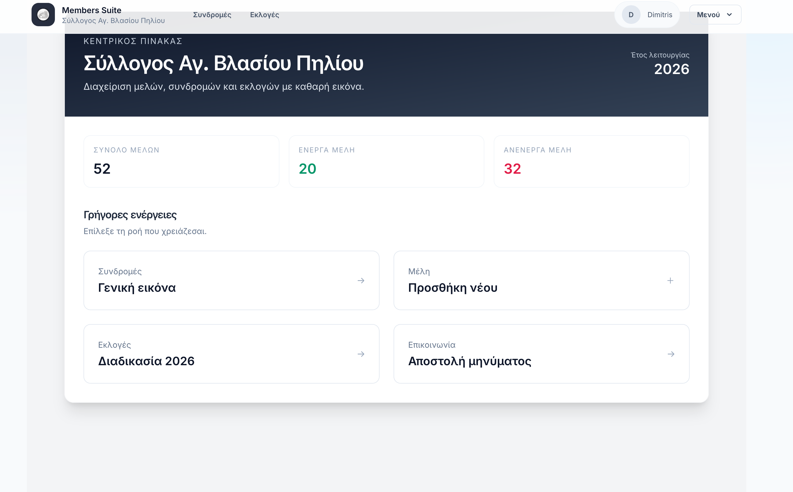
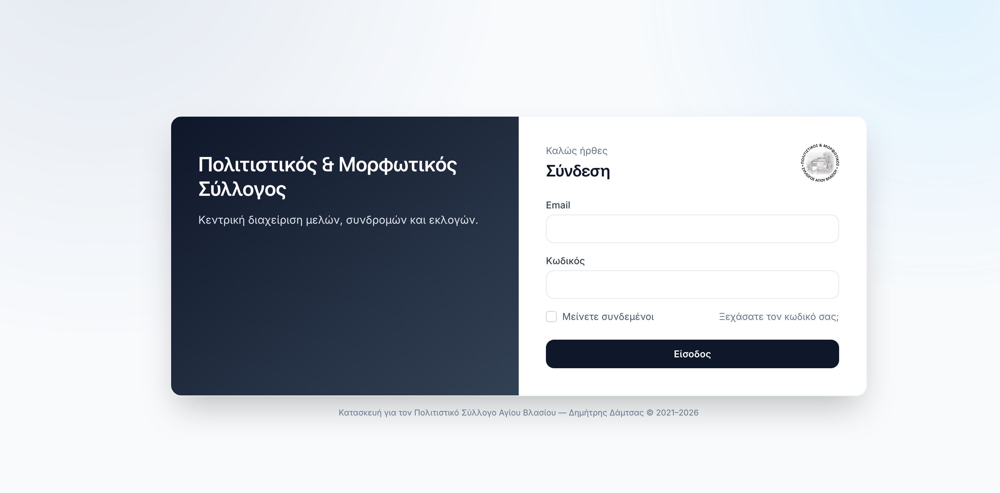
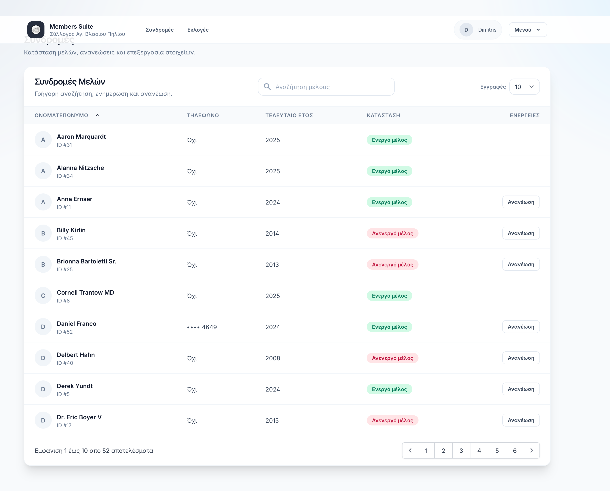

# Members Suite (2026 Refresh)

Modernized member management and elections system for a local cultural association.

## Highlights
- Laravel 12 upgrade with a modern dependency stack
- Full UI/UX refresh (login, navbar, dashboard, data tables, elections, print)
- Membership renewal logic aligned with the “previous year” rule
- Elections flow updated (eligibility and scrutineer vs board separation)
- Print ballot layout redesigned
- Build pipeline migrated to Vite

## Screens

Dashboard overview with quick actions and member statistics.


Modernized login experience with a clean, focused layout.


Membership management table with status badges and renewal actions.

## Requirements
- PHP 8.2+ (tested with 8.4)
- Node 20+
- MySQL/MariaDB

## Setup
1. Install PHP deps:
```
composer install
```

2. Install JS deps:
```
npm install
```

3. Environment:
```
cp .env.example .env
php artisan key:generate
```

4. Database:
```
php artisan migrate
```

5. Build assets:
```
npm run build
```

6. Run:
```
php artisan serve --host 0.0.0.0 --port 8000
```

## Notes
- SMS functionality is deferred for later.
- Active membership is determined by the last renewal year (previous year rule).

## Legacy
If you need the previous version, use the `https://https://github.com/dimdam/members/tree/legacy/old-version` branch.
